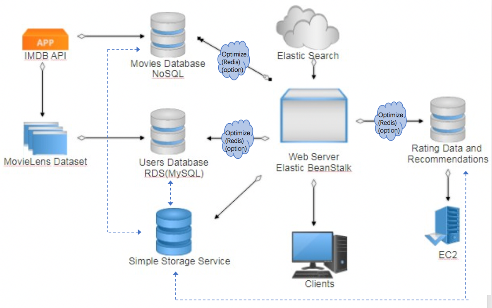

# Movie Recommendation System

Demo: http://movierecommendation-env.x5pwwcmeid.us-west-2.elasticbeanstalk.com/

## Overview

* Provides massive movie information thatusers can search, view and make ratings
* Uses machine learning algorithms to find similar movies, similar users and make recommendationsbasedon users’ ratings

## Architecture

## Implementation

* Machine learning:pandas, numpy,sklearn,collaborative filtering algorithms
* Dataset:160000 movies with 100000 ratings, OMDB API
* Database:MySQL, MongoDB
* Backend:koa(Node.js),restful APIs
* Frontend: React, AJAX, single-pageapplication
* Deployment:Docker with Elastic Beanstalk